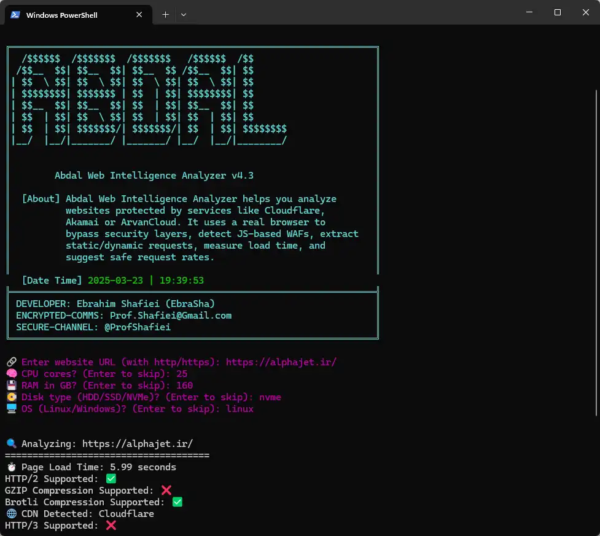

# 🕵️ Abdal Web Intelligence Analyzer

<div align="center">
  
</div>

## 🎤 README Translation
- [English](README.md)
- [فارسی](README_fa.md)


**Abdal Web Intelligence Analyzer** is a powerful and stealthy CLI-based tool for analyzing websites protected by modern **WAF/CDN** solutions such as **ArvanCloud**, **Cloudflare**, **Akamai**, and others.  
It leverages a **real headless browser** to simulate real-user behavior, bypass JS-based protections, and analyze both **static** and **dynamic** assets.
 
## 📊 Technical Capabilities

| Feature                | Description                                                                 |
|------------------------|-----------------------------------------------------------------------------|
| **Static Extraction**  | Images, CSS, JS, Fonts from full DOM                                        |
| **Dynamic Detection**  | API endpoints via fetch, axios, jQuery, forms                               |
| **Load Time Analysis** | Based on `performance.timing` from real browser                             |
| **CDN Detection**      | Analyzes headers from real HTTP responses using a headless browser          |
| **WAF Detection**      | Detects redirects, JS challenges, ArvanCloud security layers                |
| **Protocol Scan**      | Checks support for HTTP/2, HTTP/3, and QUIC (via ALPN)                      |
| **Rate Suggestion**    | Calculates safe RPS (Requests/sec) based on CPU, RAM, Disk, OS              |


## 🚀 Features

- ✅ Bypasses advanced WAF protections (e.g., ArvanCloud, Cloudflare, etc.)
- 🧠 Real browser rendering using `undetected_chromedriver` and `selenium-wire`
- 🌐 Detects active CDN providers by analyzing real **HTTP response headers**
- 🔍 Scans for:
  - Static Assets (Images, CSS, JS, Fonts)
  - Dynamic Endpoints (AJAX, APIs, Forms, Hidden routes)
- ⏱️ Measures full page load time using `window.performance.timing`
- ⚡ Estimates recommended RPS (requests per second) based on system specs
- 📡 Detects HTTP/2, HTTP/3, and QUIC protocol support
- 🛡️ Identifies JavaScript-based WAF protection (e.g., ArvanCloud challenges)
- ⚙️ Supports both **Linux** and **Windows**
- 🖥️ Lightweight & fast **CLI-based interface**, no GUI required

 

## 📋 Prerequisites

Before running the analyzer, make sure you have the following installed:

```bash
pip install beautifulsoup4
pip install httpx
pip install colorama
pip install undetected-chromedriver
python -m ensurepip --upgrade
python -m pip install setuptools

```

## 🔍 How It Works

The analyzer uses a stealth headless browser (based on `undetected_chromedriver`) to simulate a real user visiting a website. It performs the following steps:

1. **Browser Launch**: Starts a headless Chromium instance with bot detection disabled.
2. **WAF Detection**: If a known WAF page (like ArvanCloud's JS challenge) is detected, it waits until the JS challenge passes and the page reloads.
3. **Page Load Time Measurement**: Uses `window.performance.timing` to measure the real page load time from the browser's perspective.
4. **Content Extraction**:
   - Extracts static assets: images, CSS files, JavaScript files, and fonts.
   - Detects dynamic endpoints using patterns such as `fetch()`, `axios`, `XMLHttpRequest`, forms, and query URLs.
5. **Resource Counting**: Totals static and dynamic requests found in the DOM.
6. **Performance Estimation**: Based on optional CPU, RAM, Disk, and OS input, calculates an estimated optimal RPS (requests per second) the server can handle for static/dynamic content.


---

 

## 🐳 Docker Installation & Usage

You can run the Abdal Web Intelligence Analyzer instantly using Docker, without needing to install Python dependencies.
 

### 📥 Pull the Docker Image


```bash

docker pull ebrasha/abdal-web-intelligence-analyzer

docker run -it  ebrasha/abdal-web-intelligence-analyzer

```


## 🛠️ Usage

### ▶️ If you are using **Windows**:

 Simply run the `run.bat` file by double-clicking it or executing it via terminal:
```bat
run.bat
```

1. Run the script:
```bash
python abdal-web-intelligence-analyzer.py
```

2. Enter the website URL when prompted (include http:// or https://)

3. Optionally provide your server specifications:
   - Number of CPU cores
   - RAM in GB
   - Disk type (HDD/SSD/NVMe)
   - OS type (Linux/Windows)

4. The analyzer will display:
   - Page load time
   - Number of static assets (images, CSS, JS, fonts)
   - Number of dynamic requests detected
   - Recommended RPS for both static and dynamic content

## 📊 Output Example

```
🔍 Analyzing: https://example.com
=====================================
⏱️ Page Load Time: 2.45 seconds
📸 Images: 12
🎨 CSS Files: 5
📜 JS Files: 8
🔠 Fonts: 3
⚙️ Dynamic Requests Detected: 15
-------------------------------------
📊 Total Static Requests: 28
📊 Total Dynamic Requests: 15

⚙️ Suggested Static Requests/second: 25
⚙️ Suggested Dynamic Requests/second: 12
```

## 🐛 Reporting Issues

If you encounter any issues or have configuration problems, please reach out via email at Prof.Shafiei@Gmail.com. You can also report issues on GitLab or GitHub.

## ❤️ Donation

If you find this project helpful and would like to support further development, please consider making a donation:
- [Donate Here](https://ebrasha.com/abdal-donation)

## 🤵 Programmer

Handcrafted with Passion by **Ebrahim Shafiei (EbraSha)**
- **E-Mail**: Prof.Shafiei@Gmail.com
- **Telegram**: [@ProfShafiei](https://t.me/ProfShafiei)

## 📜 License

This project is licensed under the GPLv2 or later License. 