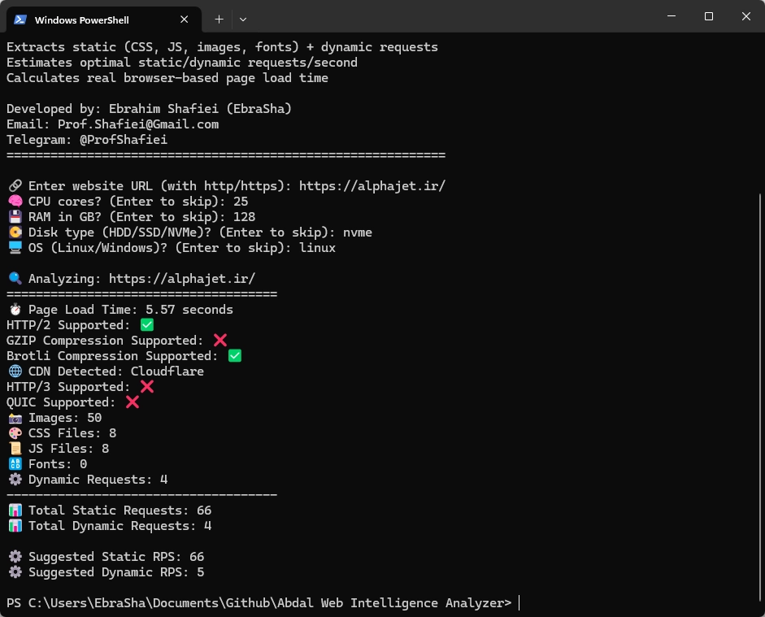

# 🕵️ ابزار تحلیل هوشمند وب ابدال

<div align="center">
  
</div>

## 🎤 ترجمه اطلاعات نرم افزار
- [English](README.md)
- [فارسی](README_fa.md)


ابزار **تحلیلگر هوشمند وب ابدال** یک سامانه قدرتمند و پیشرفته در محیط خط فرمان است که برای بررسی و تحلیل وب‌سایت‌هایی طراحی شده که پشت سامانه‌های حفاظتی مدرن مانند دیوار آتش کاربردی (WAF) و شبکه توزیع محتوا (CDN) قرار دارند، از جمله: **ابر آروان**، **کلودفلر**، **آکامای** و سایر ارائه‌دهندگان امنیت وب.

این ابزار با بهره‌گیری از یک **مرورگر واقعی بدون رابط گرافیکی**، رفتار کاربران انسانی را شبیه‌سازی کرده، سامانه‌های امنیتی مبتنی بر جاوااسکریپت را دور می‌زند و به‌صورت دقیق منابع **ایستا** (مانند تصاویر و کدهای ظاهری) و **پویا** (مانند مسیرهای برنامه‌نویسی و رابط‌های داده‌ای) را شناسایی و تحلیل می‌کند.

## 📊 قابلیت‌های فنی

| قابلیت                 | توضیحات                                                                 |
|------------------------|--------------------------------------------------------------------------|
| **استخراج استاتیک**    | شناسایی تصاویر، CSS، JS و فونت‌ها از داخل DOM کامل صفحه                |
| **تشخیص داینامیک**     | شناسایی endpointهای API از طریق fetch، axios، jQuery و فرم‌ها          |
| **تحلیل زمان بارگذاری**| محاسبه زمان بارگذاری با استفاده از `performance.timing` در مرورگر واقعی |
| **تشخیص CDN**          | تحلیل هدرهای پاسخ واقعی HTTP با استفاده از مرورگر Headless             |
| **شناسایی WAF**        | شناسایی ریدایرکت‌ها، چالش‌های JS و لایه‌های امنیتی مثل ArvanCloud      |
| **بررسی پروتکل‌ها**     | بررسی پشتیبانی از HTTP/2، HTTP/3 و QUIC (با استفاده از ALPN)           |
| **پیشنهاد RPS ایمن**   | محاسبه نرخ امن درخواست‌ها بر اساس مشخصات سخت‌افزاری سیستم              |
  


## 🚀 ویژگی‌ها

- ✅ عبور از محافظت‌های پیشرفته‌ی WAF (مثل ArvanCloud، Cloudflare و ...)
- 🧠 رندرینگ مرورگر واقعی با استفاده از `undetected_chromedriver` و `selenium-wire`
- 🌐 شناسایی دقیق CDN فعال از طریق هدرهای واقعی پاسخ HTTP
- 🔍 اسکن برای:
  - دارایی‌های استاتیک (تصاویر، CSS، JS، فونت‌ها)
  - مسیرهای داینامیک (AJAX، API، فرم‌ها، مسیرهای مخفی)
- ⏱️ محاسبه زمان بارگذاری واقعی صفحه با `window.performance.timing`
- ⚡ برآورد نرخ مناسب درخواست در ثانیه (RPS) بر اساس CPU، RAM، Disk و سیستم‌عامل
- 📡 تشخیص پشتیبانی از HTTP/2، HTTP/3 و QUIC
- 🛡️ شناسایی وجود WAFهای مبتنی بر JavaScript مانند چالش‌های ArvanCloud
- ⚙️ پشتیبانی کامل از سیستم‌عامل‌های **Linux** و **Windows**
- 🖥️ کاملاً بدون رابط گرافیکی (GUI) — عملکرد سریع و سبک در محیط CLI

## 📋 پیش‌نیازها

قبل از اجرای ابزار، مطمئن شوید که موارد زیر را نصب کرده‌اید:

```bash
pip install beautifulsoup4
pip install httpx
pip install colorama
pip install undetected-chromedriver
```

## 🔍 نحوه کار

این ابزار با استفاده از مرورگر مخفی (Stealth Headless Chrome) مبتنی بر `undetected_chromedriver`، دقیقاً مانند یک کاربر واقعی وارد سایت می‌شود و مراحل زیر را انجام می‌دهد:

1. **راه‌اندازی مرورگر**: اجرای مرورگر کرومیوم به‌صورت Headless با تنظیمات ضد تشخیص ربات.
2. **تشخیص WAF**: در صورت شناسایی صفحه محافظتی (مانند چالش JS آروان‌کلود)، صبر می‌کند تا مرورگر به صورت خودکار از آن عبور کند و صفحه اصلی بارگذاری شود.
3. **محاسبه زمان لود واقعی صفحه**: با استفاده از `window.performance.timing`، زمان دقیق بارگذاری صفحه از نگاه مرورگر محاسبه می‌شود.
4. **استخراج منابع**:
   - منابع استاتیک مانند تصاویر، فایل‌های CSS، اسکریپت‌های JS و فونت‌ها استخراج می‌شوند.
   - درخواست‌های داینامیک (API، AJAX، فرم‌ها، URLهای دارای پارامتر) با تحلیل محتوای HTML و اسکریپت‌ها شناسایی می‌شوند.
5. **شمارش منابع**: تعداد درخواست‌های استاتیک و داینامیک در صفحه شمارش می‌شود.
6. **تخمین عملکرد سرور**: با توجه به اطلاعات اختیاری واردشده توسط کاربر (تعداد هسته CPU، رم، نوع دیسک، نوع سیستم‌عامل)، نرخ بهینه درخواست در ثانیه (RPS) برای منابع استاتیک و داینامیک پیشنهاد داده می‌شود.

## 🛠️ نحوه استفاده

1. اجرای اسکریپت:
```bash
python main.py
```

2. وارد کردن آدرس وب‌سایت در زمان درخواست (شامل http:// یا https://)

3. اختیاری: وارد کردن مشخصات سرور:
   - تعداد هسته‌های CPU
   - مقدار رم به گیگابایت
   - نوع دیسک (HDD/SSD/NVMe)
   - نوع سیستم‌عامل (لینوکس/ویندوز)

4. ابزار موارد زیر را نمایش می‌دهد:
   - زمان بارگذاری صفحه
   - تعداد منابع استاتیک (تصاویر، CSS، JS، فونت‌ها)
   - تعداد درخواست‌های داینامیک شناسایی شده
   - نرخ پیشنهادی درخواست در ثانیه برای محتوای استاتیک و داینامیک

## 📊 نمونه خروجی

```
🔍 تحلیل: https://example.com
=====================================
⏱️ زمان بارگذاری صفحه: 2.45 ثانیه
📸 تصاویر: 12
🎨 فایل‌های CSS: 5
📜 فایل‌های JS: 8
🔠 فونت‌ها: 3
⚙️ درخواست‌های داینامیک شناسایی شده: 15
-------------------------------------
📊 مجموع درخواست‌های استاتیک: 28
📊 مجموع درخواست‌های داینامیک: 15

⚙️ پیشنهاد درخواست استاتیک در ثانیه: 25
⚙️ پیشنهاد درخواست داینامیک در ثانیه: 12
```

## 🐛 گزارش مشکلات

اگر با مشکلی مواجه شدید یا در پیکربندی مشکل دارید، لطفاً از طریق ایمیل Prof.Shafiei@Gmail.com با ما در تماس باشید. همچنین می‌توانید مشکلات را در GitLab یا GitHub گزارش دهید.

## ❤️ حمایت مالی

اگر این پروژه برای شما مفید بود و مایل به حمایت از توسعه بیشتر هستید، لطفاً در نظر داشته باشید که کمک مالی کنید:
- [اینجا اهدا کنید](https://alphajet.ir/abdal-donation)

## 🤵 برنامه‌نویس

ساخته شده با عشق توسط **ابراهیم شفیعی (EbraSha)**
- **ایمیل**: Prof.Shafiei@Gmail.com
- **تلگرام**: [@ProfShafiei](https://t.me/ProfShafiei)

## 📜 مجوز

این پروژه تحت مجوز GPLv2 or later منتشر شده است. 